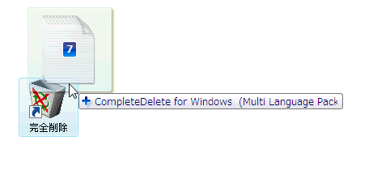
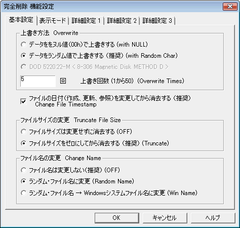

完全削除  Complete Delete for Windows

---

## 概要

ファイル復元ソフトの能書曰く ***「間違って削除したファイルを復活することができる」*** 。 一見便利そうなこの言葉の裏側に、大きな危険が潜んでいます。 普通に削除しただけのファイルは、容易に復活できることもあります。

暗号化されていないWindowsのディスクは、たとえユーザのログオンパスワードが分からなくても、ディスクを取り出して解析されれば何の防御策もなく全データが取り出されてしまう可能性があります。このような場合、秘密にしておきたいデータを削除するときに、Windows標準の「削除」処理では不十分です。

このソフトウエアは、削除したファイルを **復元ソフトなどを用いて復元しにくくする、セキュリティ確保ツール** です。具体的には、ファイルを乱数や特定の文字を書きこんでデータを完全に破壊します。 

##  重要説明事項 

ファイルの完全削除を行おうと考える前に、添付ヘルプファイルおよび『完全削除の限界と対処法』を必ずお読みください。 

###  本ソフトウエアの各国政府基準対応可否について 

拙作”完全削除”の機能設定を工夫することで、各国のセキュリティ基準をどの程度満たせる可能性があるか、表に取りまとめてみました 

対応可否 | 規格名| 制定日 | 上書き回数 | 上書きパターン | 備考
---|---|---|---|---|---
可 | 米国 NIST SP-800-88 [1] | 2006 | 1回 | 規定せず | 
否 | 米国 NSA/CSS Policy Manual 9-12 [2] | 2006 | - | | 消磁または物理的破壊による
可 | 米国 NISP Operating Manual (DoD 5220.22-M)[3] | 2006 | | | 規定せず
否 | 米国 国防総省 Unclassified Computer Hard Drive Disposition [4] | 2001 | 3回 | ある文字, その補数の文字, 任意文字 | 
否 | 米国 海軍 Staff Office Publication NAVSO P-5239-26[5] | 1993 | 3回 | ある文字, その補数の文字, 乱数文字 | ベリファイ必須
否 | 米国 空軍 System Security Instruction 5020 [6] | 1996 | 4回 | 0, 1, 任意文字 | ベリファイ必須

なお、ハードディスクの高密度化により、実際には1回の上書き処理で十分であるとアメリカ国立標準技術研究所（NIST）が2006年に発表したSpecial Publication 800-88の7ページで述べています。つまり、実際には1回の上書き処理で十分だということです。（フロッピーディスクなど、低密度な記憶媒体では、以前に定められている基準の通り3回上書き等が必要） 

##  機能の概略 

プログラムの初回起動時に、デスクトップ上にアイコンが作られます（マウスの右クリック メニューに入れることも可能）。完全削除したいファイルを、デスクトップ アイコンにドラッグ アンド ドロップするか、右クリック メニューの項目を選択することでファイルの完全削除処理を行うことが出来ます。 

削除したいファイルを、デスクトップの「完全削除」にドラッグ アンド ドロップします 

設定画面

なお、間違って必要なファイルまで削除してしまう事故を防ぐため、ディレクトリ（フォルダ）の完全削除には対応させていません。ファイルを一つずつ削除してください。

###  もう少し詳しい技術的説明 

このプログラムは、ファイルの読み込みと書き込みが物理ディスク上の同一クラスタであると仮定して、削除処理（データの上書き処理）を行っています。簡単にいえば、ファイルを上書きしているだけです。

アメリカ国立標準技術研究所が2006年に出したレポートによれば、最近の高密度記録されているハードディスクでは削除回数（データの上書き回数）は1回でよいとされています。しかし、過去には複数回の上書き処理が推奨されていたこともあり、拙作”完全削除”では初期設定で複数回上書きするように設定されています（機能設定：基本設定で上書き方法の設定が可能）。

***本当に削除されているかの簡単な確認方法***

USBフラッシュメモリに小さなパーティション（数百メガバイト）を作成し、そこに削除したいファイルを通常の利用形態で置いてください。そして、拙作「完全削除」で削除してください。

その後、WindowsサポートツールのDiskProbe.exeまたはLinuxのddコマンド等でハードディスクの全クラスタを検索してください。この検索時の検索条件（検索文字列に日本語が使えるかどうかなど条件がある）にあった形のデータファイルを削除実験するのが楽かと思います。

拙作「完全削除」製作時には、このような削除実験を各種メディア、フォーマット形式、ファイルサイズで実験し一般的な利用形態では問題ないことを確認していますが、念のためユーザ側でも検証していただいたほうが安心してお使いいただけると思います。

簡易的に削除状態を確認するために、削除段階ごとにユーザの確認を求めるダイアログボックスを表示するモード（機能設定：表示モード設定で設定可能）に切り替えることが出来ます。「単にファイルを上書きしている」ことを確認するレベルでよいのであれば、この機能をお使いください。 

## 制限事項

次のような条件に合致する場合、完全削除されない可能性があります。技術的詳細は「完全削除の限界と対処法」を参照してください。

- Microsoft WordやExcelのような編集ごとに自動バックアップや、一時ファイルを作成するソフトウエアで扱われるファイル
- NTFS上のスパースファイル、暗号化ファイル、圧縮ファイル、MFT内のデータストリームに収まる1kBytes程度のファイル
- 自動的にバックアップが作成されている、クラウド（ネットワーク ドライブ）上のファイルなど 

また、次の条件に合致するファイルは削除されず、エラーダイアログが表示されることもあります。

- ファイルサイズが2GBytesを越える場合（Visual C++ 2003版MFCでは32ビットファイルポインタを利用しているため）
- Windows98系の場合、DOSが認識できるより深いディレクトリにあるファイル
- 多数のファイルをドラッグ アンド ドロップするなど、コマンドライン引数が規定（Windows98系の場合256Bytes, Windows XP系の場合2048Bytes）サイズを超える場合
- ファイルへ書き込みが出来ない場合（CD-R,CD-RW,DVD-R,DVD-RWなど） 

Windows 7でヘルプファイルが表示できない場合、ファイル エクスプローラでヘルプファイルを右クリックしてファイルのプロパティ画面を開き、セキュリティの「制限を解除する」ボタンを押すことで表示できるようになります。 

## より安全を期するために 

技術的詳細は「完全削除の限界と対処法」に記載しましたが、次のような対処法を行うことで、仮に完全削除が出来ていない場合でもより安全性を高めることができます。

- 仮想メモリの無効化（搭載メモリが十分ある場合、Windowsコントロールパネルのシステム設定で無効化しておきます）
- 暗号化仮想ディスクの利用（TrueCryptの仮想ディスクを用いる）
- 拙作”完全削除”で処理後、ディスクの空き領域を完全消去する（Windows XP系に標準添付のcipher.exeを用いる）
- Windowsデフラグの実行（並べ替えが行われるときに、上書きされる可能性がある程度の効果） 

## 動作環境

- Windows 95/98/Me/NT4/2000/XP/Vista/7 

  - FAT ファイル・システム
  - NTFS ファイルシステム（一部制限あり）
  - 特別なファイル保護機能を組み込んでいないこと
  - 管理者権限不要（ユーザ権限で実行可能） 

## バージョンアップ情報

- Version 1.0

  - 当初バージョン（公開用） 

- Version 1.1 (1999/02/20)

    - ユーザーインターフェースの見直し 
    - ヘルプファイルの作成 
    - ショートカット作成用のインストール･ボタンの追加 
    - 安全のためフォルダ･サポートの停止 
    - 表示のバグ･フィックス 

- Version 1.2 (2002/04/01)

    - Windows NT/2000/XP対応（スペースを含むフパス名のサポート） 
    - インストール・アンインストール方式の変更 
    - 英語のリソースを追加 

- Version 1.3 (2002/05/08)

    - セキュリティ耐性の向上 

- Version 1.36b (2002/11/20)

    - NTFSのMFT内に収まるファイルの削除 (ミラーMFTは未対応) 
    - 遅延書き込み、ディスクキャッシュに対する暫定対応（ダミーファイル書き込み） 
    - 最終削除しないオプションの追加 
    - ファイルバッファ量の調整可 

- Version 1.36c (2005/06/22)

    - 結果表示ダイアログで、削除方法がNULLとRNDが逆になっていたのを修正 

- Version 1.37 (2007/01/21)

    - Html Help （ .chm）にヘルプファイルを変更 
    - アイコン・リソースを追加 
    - Windows Vista 対応 

- Version 1.38 (2012/02/18)

    - 2GBytes以上のファイルの検出・エラー表示化 
    - NTFS スパース ファイルの検出・エラー表示化 
    - 50MBytes以上のファイルの処理中経過サイズ表示 

## 主な掲載雑誌

  - DOS/V Magazine (ソフトバンク) 
  - DOS/V USER (宝島社) 
  - 窓の杜 (インプレス) 
  - PC JAPAN （ソフトバンク） 
  - ウインドウズ・パワー（アスキー） 
  - インターネットスタート・ウインドウズＲｏｍ！（毎日コミュニケーションズ） 
  - CD-ROM Fan （毎日コミュニケーションズ） 
  - テックウイン（アスキー） 
  - 週間アスキー （アスキー） 
  - 月刊アスキー （アスキー） 
  - ネットランナー （ソフトバンク） 
  - 日刊ゲンダイ （日刊ゲンダイ） 
  - INTERNET HUNTER （ダイアプレス） 
  - Windows2000 World （IDGジャパン） 
  - 月刊ＰＣＭＯＤＥ（毎日コミュニケーションズ） 
  - 窓の杜（インプレス） 
  - Windows Start （毎日コミュニケーションズ） 
  - エデュカーレ 教育情報誌 （第一学習社） 
  - ウルトラ ONE （宝島社） 
  - 暮らしとパソコン （ソフトバンク） 
  - 日経クリック （日経BP社） 
  - Yahoo BBマガジン （ソフトバンク） 

## ライセンス

このスクリプトは [GNU General Public License v3ライセンスで公開する](https://gpl.mhatta.org/gpl.ja.html) フリーソフトウエア

※ 配布ソースコード等に書かれているライセンス条項は撤回し、上述GNU General Public License v3ライセンスにて配布する。
