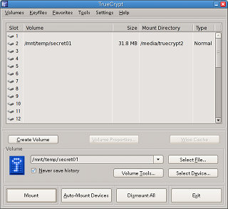
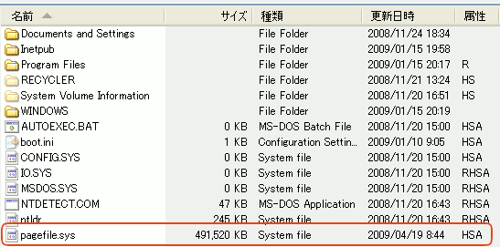
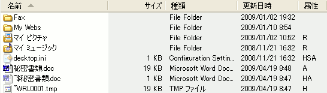

## 完全削除の限界と対処法<!-- omit in toc -->

[Home](https://oasis3855.github.io/webpage/) > [Software](https://oasis3855.github.io/webpage/software/index.html) > [Software Download](https://oasis3855.github.io/webpage/software/software-download.html) > [win-compdel](README.md) > ***完全削除の限界と対処法*** (this page)

<br />
<br />

Last Updated : Feb. 2012    --   ***this is discontinued  software 開発終了***

<br />
<br />

技術的内容を読みたくない方も、***必ず第1章の「条件ごとの完全削除（完全消去）の可能性」だけはお読みください***。その上で、興味を持ったキーワードがあれば、このページ内のトピックを読んでいただければいよいと思います。


- [条件ごとの完全削除（完全消去）の可能性](#条件ごとの完全削除完全消去の可能性)
- [完全消去・完全秘匿に近づくための対策手法](#完全消去完全秘匿に近づくための対策手法)
  - [NTFSの圧縮・暗号化機能の無効化](#ntfsの圧縮暗号化機能の無効化)
  - [仮想メモリ機能を無効化する](#仮想メモリ機能を無効化する)
  - [テンポラリ ディレクトリ内の一時ファイルを削除する](#テンポラリ-ディレクトリ内の一時ファイルを削除する)
  - [ディスク空き領域の削除 （Windows標準の機能）](#ディスク空き領域の削除-windows標準の機能)
  - [暗号化仮想ディスクを用いる](#暗号化仮想ディスクを用いる)
  - [Linuxでファイルの完全削除を行う](#linuxでファイルの完全削除を行う)
  - [ディスク全領域の完全消去処理](#ディスク全領域の完全消去処理)
- [FATファイルシステムと完全削除](#fatファイルシステムと完全削除)
  - [FATファイルシステム](#fatファイルシステム)
  - [ファイル削除と復活](#ファイル削除と復活)
  - [完全削除とは](#完全削除とは)
- [NTFSでの問題点をもう少し深く技術的に解説](#ntfsでの問題点をもう少し深く技術的に解説)
  - [遅延書き込み（キャッシュ システム）](#遅延書き込みキャッシュ-システム)
  - [圧縮ファイル、暗号化ファイル（EFS）、スパース ファイル](#圧縮ファイル暗号化ファイルefsスパース-ファイル)
  - [MFTデータ ストリーム（データ アトリビュート）](#mftデータ-ストリームデータ-アトリビュート)
  - [代替データ ストリーム（ADS）](#代替データ-ストリームads)
  - [まとめ](#まとめ)
- [NTFS （NTファイルシステム）の概要](#ntfs-ntファイルシステムの概要)
  - [NTFS の特徴](#ntfs-の特徴)
  - [メタファイル](#メタファイル)
  - [MFT](#mft)
  - [ファイルの例](#ファイルの例)
- [仮想メモリと一時ファイルによるセキュリティリスク](#仮想メモリと一時ファイルによるセキュリティリスク)
  - [Windowsでの仮想メモリ](#windowsでの仮想メモリ)
  - [システムの休止状態で、全メモリがディスクに書き出される](#システムの休止状態で全メモリがディスクに書き出される)
  - [Microsoft WordやExcelファイルは完全消去出来ない](#microsoft-wordやexcelファイルは完全消去出来ない)

<br />
<br />


## 条件ごとの完全削除（完全消去）の可能性

技術的詳細がわからない方も、この一覧表は必ず通読してください。ここで「削除不可」となっているファイルは、拙作”完全削除”のみでなく、世間で公開されている他の完全消去ソフトウエアでも、技術的に削除不可能・きわめて難しいものです。

- FATファイルシステムのファイル → 確実に可能
- NTFSの暗号化ファイル（EFS） → 疑問
- NTFSの圧縮ファイル → 疑問
- NTFSの1kBytes以下（MFTデータストリーム内に収まる）ファイル → 初回データは残存
- NTFSのスパース ファイル（かなり特殊な用途のファイル） → 不可
- NTFSの代替ストリーム ファイル（かなり特殊な用途のファイル） → 不可
- NTFSの***上述に当たらない通常のファイル*** → ほぼ可能
- DropboxやAmazon S3などのクラウドに格納されたファイル → 不可
- 編集時にオリジナルのコピーの一時ファイルを作成するソフト(***Microsoft WordやExcel等のデータファイル***) → ***不可*** 

## 完全消去・完全秘匿に近づくための対策手法

###  NTFSの圧縮・暗号化機能の無効化

ファイル エクスプローラでファイルもしくはフォルダを右クリックして、プロパティよりこれらの機能を確実にOFFにします。なお、暗号化機能はWindows 2000/XP/7 Professional版以上でしか使えません（一般のパソコンにバンドルされているWindows XP/7 Homeにこの機能は存在しませんので安心してください）。

また、暗号化・複合化処理に複合化されているファイルを一時ファイルに書き出しているため、セキュリティリスクがあるとMicrosoftが公式に認めていることは留意しておく必要があるでしょう。

When an existing plaintext file is marked for encryption, it's first copied to a temporary file. When the process is complete, the temporary file is marked for deletion, which means portions of the original file may remain on the disk and could potentially be accessible via a disk editor. These bits of data, referred to as data shreds or remanence, may be permanently removed by using a revised version of the cipher.exe tool. (from: Microsoft TechNet "The Encrypting File System" [(link)](https://docs.microsoft.com/en-us/previous-versions/tn-archive/cc700811(v=technet.10)?redirectedfrom=MSDN))

###  仮想メモリ機能を無効化する

仮想メモリ ファイルに消去したいデータが平文で記録されていては、ファイル本体をいくら完全消去しても意味がありません。十分な物理メモリをコンピュータに取り付けている状態では仮想メモリ機能は無効化するとよいでしょう。

**Windows 2000/XP/7の場合**

システム コントロールパネル → 詳細設定 → パフォーマンス設定 → 詳細設定 → 仮想メモリ変更 を開き、すべてのドライブで”ページングファイルなし”と設定する。設定を行った後は、必ずWindowsの再起動が必要です。

**Linuxの場合**

ルート権限で```swapoff```コマンドを実行して仮想メモリを一時的に無効化できます。再び仮想メモリを使いたくなればswaponコマンドを実行すればよいでしょう。十分なメモリを搭載していて起動時から仮想メモリを無効化したい場合は、スワップパーティションを削除する必要があります。 

###  テンポラリ ディレクトリ内の一時ファイルを削除する

Windowsでは環境変数TEMPで示されたテンポラリ ディレクトリに作られる一時ファイルは自動的には削除されません。たとえば、次のようなスクリプトファイルを作成して、タスクスケジューラでシステム起動時や定時に実行するようにすれば、長期間一時ファイルが残存することを阻止できます。ただし、一時ファイルが何らかのソフトウエアで利用中の場合、思わぬ副作用がある可能性もありますので留意してください。

```
del "C:\Documents and Settings\hogehoge\Local Settings\Temp\*.tmp"
```

なお、環境変数はシステム コントロールパネルで確認する以外にも、コマンドプロンプトでset tempと実行すれば画面に表示されます。

###  ディスク空き領域の削除 （Windows標準の機能）

Windows 2000/XP/Vista/7 は標準で空き領域の削除コマンドcipher.exeを持っています。管理者権限でログオンし、コマンド・コンソール（cmd.exe）内で次のように実行してください。（d: ドライブを対象とする例） 

```
cipher.exe /w:d:
```

大容量ハードディスクでこの機能を利用した場合、何時間も掛かることに注意してください。150MBytes/secのアクセス速度を持つハードディスクに500GBytes書き込みするのに要する時間は 500*1024/150 = 3413秒（＝56分）。USB2.0接続のハードディスクなら50MBytes/sec程度しか速度が出ないため168分にもなります。

【Windows で Cipher.exe を使用して削除済みのデータを上書きする方法 ： [(link)](https://docs.microsoft.com/en-US/troubleshoot/windows-server/windows-security/use-cipher-to-overwrite-deleted-data) 】

単に大きなファイルを作成してフリー領域を埋めたい場合は、管理者権限でfsutil.exeコマンドを用います。1MBytesのファイル（NULLで埋められている）を作成するには次のようなスクリプトになります。

```
fsutil.exe file createnew ファイル名.txt 1048576
```

###  暗号化仮想ディスクを用いる

編集時にオリジナルファイルのコピー（一時ファイル）を作成するMicrosoft Office等のアプリケーションソフトで扱うデータファイルの保存先を、暗号化仮想ディスクとすることで、暗号解読しない限り情報流出しないように対策できます。（一時ファイルも暗号化仮想ディスク中に作成されるため）

**Windows / Linux 共通の手法**

TrueCryptまたは[VeraCrypt](https://veracrypt.fr/en/Home.html)（無償ソフトウエア）を用いると、WindowsとLinuxで同じ暗号ディスクファイルを使いまわすことが出来ます。今後、LinuxとWindowsの双方を使う可能性がある場合はこの方法をお勧めします。 



LinuxでのTrueCrypt実行画面（暗号化ボリューム管理画面） 

###  Linuxでファイルの完全削除を行う

Linuxでは完全削除を行うプログラム```shred```が標準で提供されています。1回上書きで完全削除する場合は次のようにします。

```
shred -n 1 -v ファイル名
```

###  ディスク全領域の完全消去処理

ハードディスクやUSBメモリーディスクを処分する前に行う、ディスク全領域の完全消去処理についての解説です。この処理を行ったディスクは「残留磁気を読み取るような高度な解析装置」を持つ一部の国家機関やハードディスク製造メーカーが有する世界で数箇所のラボでしか復元できないといわれています。

**Windowsの場合**

消去したいディスクをフォーマットした後に、管理者権限でcipher.exeコマンドを実行します。（D:ドライブを消去する場合）

```
cipher.exe /w:d:
```

**Linuxの場合**

shredコマンドを用いれば、未フォーマットのディスク全領域を完全消去出来ます。例えば、次のようなコマンドを実行します。

```
shred -n 3 -z -v /dev/sda1
```

上記の例は、/dev/sda1に対して、3回上書き処理＋1回ゼロクリアを行います。ユーザがより詳細に制御したい場合は、ddコマンドを用いても、これと同様の処理ができます。

```
dd if=/dev/urandom of=/dev/sda1
dd if=/dev/urandom of=/dev/sda1
dd if=/dev/urandom of=/dev/sda1
dd if=/dev/zero of=/dev/sda1
```

なお、ddを用いるときはブロックサイズを適当な大きさまで拡大しておかないと、ディスクアクセス速度が極めて遅くなるので要注意。たとえば、書き込み単位を10MBytes（10*1024*1024bytes）にする場合は…

```
dd if=/dev/zero of=/dev/sda1 bs=10M 
```

## FATファイルシステムと完全削除

話を分かりやすくするため、単純なFATファイルシステムでのファイル削除を例として説明します。

### FATファイルシステム

MS-DOSやWindows95/98時代から存在しているFATファイルシステムは、ディスク上のどこにファイルのデータが格納されているのかを管理するFAT（ファイル アロケーション テーブル）と、ファイル名などを管理するディレクトリ エントリから構成されています。NTFSと違いユーザ権限管理や暗号化などは実装されていません。

ディレクトリ エントリとは、ディレクトリ属性の付いた特別なファイルで、下の図のような固定長リストによりファイルを管理しています。一つのファイルを管理するために、ファイル名（DOSの8.3形式）、属性（読取専用、隠し、システム、ディレクトリ、ディスクラベルなど）、変更時間、変更日付、ファイル アロケーション テーブルへのポインタ、ファイル サイズ（バイト単位）などを保持しています。 


### ファイル削除と復活

ファイルを消去すると、ファイル名の先頭に「無効」を示す１バイト(上の図では"XX"、実際には16進数のE5)が書き込まれ、このファイルは消去されたとオペレーティング システムは認識します。同時に、ファイルのデータ領域を管理しているファイル アロケーション テーブルも初期化されます。（ゼロが代入される）

この「無効」を宣告された削除済みファイルデータは、ファイル名の先頭１文字だけが欠落しているだけなので、削除されたファイルであっても先頭１文字を適当に決めてやれば復活できます。 また、ファイル アロケーション テーブルの先頭は、この「無効化」されたディレクトリ エントリの管理領域に残っていますので、連続したファイル領域であれば復活できます。

***実際にファイルFILE1.TXTを復活する方法は…***

削除済みの管理領域の"?ILE1.TXT"となっている先頭1文字を"F"と変更します。 次にファイル アロケーション テーブルの先頭へのポインタが"002"のときは、002, 003, 004が一つながりのファイルであったと推測して、削除済みとして書きこまれていた"000","000","000"を"003","004","FFF"に変更します。(なお、ファイルサイズがこの3つのクラスタより大きい場合は、空いているクラスタを探してリストをつなげてゆきます。) 


### 完全削除とは

完全削除は、次の2段階で行われています。

1. ファイル・データ（実際のファイルの内容で、表計算やワープロ文書）そのものを意味の無いデータに書き換え
2. ファイル名を意味の無いものに書き換える。（ファイル サイズとファイル アロケーション テーブルへのポインタを意味の無いデータとする処理） 

これらの処理により、どんなファイルが削除されたかわかりにくくし、仮に、ファイル アロケーション テーブルへのポインタを他のファイルから推測したとしても、上書きされた意味の無いデータした取り出せないということになります。 

## NTFSでの問題点をもう少し深く技術的に解説

### 遅延書き込み（キャッシュ システム）

NTFSの遅延書き込みによりファイル名およびサイズの「完全削除」が出来ない場合があります。 また、「非常に効率的な遅延書き込み」が行われている場合、データ領域すら完全削除できない可能性もあります。

この状況に対する暫定的な対応措置として、機能設定：詳細設定２の「追加削除機能：対象ファイルと同じボリュームに一時ファイルを作る」でディスクキャッシュ量より多いサイズの追加削除（ダミーファイル作成）を行ってください。また、機能設定：基本設定の「ファイル名変更・ファイル サイ変更機能」は機能しない場合がありますので留意してください。

### 圧縮ファイル、暗号化ファイル（EFS）、スパース ファイル

圧縮ファイル、暗号化ファイル、スパース･ファイルは「完全削除」できません。これらのファイルにデータを書き込む場合、OSはファイルのコピーを自動的に作成し、そこに書き込むような仕様になっているからです。OSによる強固な書き込みエラー対策である反面、大量のコピーデータがディスク内に拡散してしまうというセキュリティリスクを作ってしまった悪い例です。 なお、拙作”完全削除”では、スパース ファイルは検出して削除処理をしないようになっています。

### MFTデータ ストリーム（データ アトリビュート）

MFTのサイズ内に収まる範囲のデータファイルに対する「完全削除」には対応していません。 原因は、MFTに収まる小さなファイルの最初の作成時に、MFTのミラー領域に作成されたミラー・データが削除後にも残るためです。（MFTのミラー領域は本プログラムでは操作出来ません）

この状況に対する暫定的な対応措置として、小さなファイル（1000バイト未満と考えて差し支えありません）の作成時には、データの末尾などに「パディング」領域を設けてMFTにデータが格納されるのを防いでください。たとえば、200バイトのテキストファイルなら、後ろに800個のスペース文字を追加するなどしてください。

MFTミラーにデータが残存することは捨ておくとして、メインMFTのデータストリームに書きこまれているデータを確実に削除するためには、機能設定：詳細設定１の「オーバーラン書き込みサイズ」を0Bytesに設定する必要があります。これは、オーバーラン機能でファイルサイズがMFTデータストリームに収まらなくなった場合、ディスク上に新たにデータ領域が作成され、MFT内は無視（放置）されるからです。

### 代替データ ストリーム（ADS）

代替データ ストリーム（マルチデータ ストリーム）を使ったファイルの場合、現在見えている（Explorerで通常扱っている）ストリームに対してのみ「完全削除」が行われます。

### まとめ

NTFSで導入されたこれらの新たな機能により「データ（ディスク）が高度に抽象化されて通常利用時の安定性・安全性」が高まった反面、「特殊な条件下を想定したデータのコントロール権」がユーザから取り上げられてしまったことで、セキュリティリスクがより高まってしまったともいえます。

ディスク内にデータの「コピー」が大量に拡散されてしまったことに対処するためには、「デフラグAPI」というWindowsシステム管理機能を利用して、ハードディスクの特定クラスタのデータを上書きすると言う手がありますが、管理者権限が必要な事と、ディスク内のどこにデータが拡散したか検知しようすがないというハードルがあります。現在見えているファイルに対してのみの処理では「完全に保証された完全削除処理」することは出来ません。

よって、圧縮・暗号・スパース ファイルなどのテクノロジを用いている場合は、「全空き領域に巨大なダミーファイルを作り、ダミーデータを書き込む」処理が最低限必要となります。ディスクのフォーマット時間でおわかりのとおり、数TBytesにもなる現在の大容量ディスクでは、これらの処理には何時間もの長い時間がかかります。

「MFTのデータストリーム領域」に消去されずに残っている残骸データに対しては、前述の巨大ダミーファイルによっても削除不可能なため、ハードディスクの全MFTレコードを解析して未使用のデータストリーム領域を全て消去して回るという膨大な作業が必要で、それらの作業中にOSが勝手にディスクにアクセスに行かないように、ロックを掛けて作業すると言う、「OSの機能の一部として作業するに等しい」プログラムを作成し管理者権限で実行しなければなりません。

このようなOSが行うべきディスクのガベージコレクションのような作業を、フリーソフトウエア レベルで安全性を保証して実行するなど不可能です。この機能は、商用ソフトウエアに譲る必要がありますので、拙作”完全削除”で実現する構想はありません。

## NTFS （NTファイルシステム）の概要

Windows NT/2000/XP以降で採用されているNTFSの概要は、このヘルプファイルで記述できるほど簡単ではありません。NTFSの簡単な紹介と、「完全削除」を行う場合に関連する点について若干の説明をとどめます。

### NTFS の特徴

- メタファイル（$MFT、$BOOT、$AttrDef …）によるディスク（ボリューム）管理
- ACL (アクセス制御リスト）によるアクセス制御
- ジャーナリング ファイル システムによるロールバック処理
- ファイル圧縮・暗号化
- ユーザごとのクォータ設定
- ボリュームのシャドゥ コピー機能で稼動中のスナップショットのバックアップ可
- スパース･ファイルのサポート
- 512Bytesから64kBytesまで柔軟なクラスタサイズの設定
- 小さなファイルをMFTのデータストリームに入れることが可能
- 代替データ ストリーム 

### メタファイル

NTFSでは、データ領域だけでなく、ディスク（NTFSの説明文ではボリュームと言う）自体の管理情報も含め、全てを「ファイル」として扱っている。その中で、ディスクの管理にかかわるファイルを特に「メタファイル」と言っている。 


### MFT

ボリューム上に存在するファイルは、全て「マスター ファイル テーブル（MFT)」によりリスト管理されている。
ヘッダには、最初のアトリビュートの位置とフリーエリアの先頭位置の情報などが含まれている。アトリビュートはファイル名、ボリューム名、セキュリティ記述子、データなどさまざまなものが定義されており、必要に応じて（必要な数だけ）使われる。 


アトリビュートは以下のようなものがあり、MFTでは、$FILE_NAME、$SECURITY_DESCRIPTERはほぼ常に存在している。 


各アトリビュートは、先頭にはヘッダ（MFTのヘッダとは違う）があり、その後にアトリビュートごとに定義されたデータが続いている。
参考例として、$FILE_NAME アトリビュートを下に示す。


### ファイルの例

実際のファイルの格納は、これらの機構を使って下の図のように行われている。データサイズが小さなファイルの場合は、直接MFTのフリーエリアに$DATAアトリビュートを作りそこに格納する。（FATからの大きな進歩）


## 仮想メモリと一時ファイルによるセキュリティリスク

### Windowsでの仮想メモリ

[物理メモリ](https://ja.wikipedia.org/wiki/%E4%B8%BB%E8%A8%98%E6%86%B6%E8%A3%85%E7%BD%AE)を効率的に管理するために、[仮想メモリ](https://ja.wikipedia.org/wiki/%E4%BB%AE%E6%83%B3%E8%A8%98%E6%86%B6)というメモリ管理手法がWindowsやLinuxでは採用されています。
Windows XPでは、次の画面例で一番下に表示されている「pagefile.sys」が、この仮想メモリで用いられているスワップファイルです。 



「秘密にしたいファイル」を編集する時に、物理メモリ上に展開された「秘密のデータ」が、オペレーティングシステムの[仮想メモリ管理機能](https://ja.wikipedia.org/wiki/%E3%83%9A%E3%83%BC%E3%82%B8%E3%83%B3%E3%82%B0%E6%96%B9%E5%BC%8F)によって自動的にスワップファイルに（暗号化すらされずに）書き込まれる場合があります。

「秘密にしたいファイル」を消去するときには、当然、このスワップファイルも完全消去しなくてはいけませんが、稼働中のオペレーティングシステムのスワップファイルを上書き処理するなどということは、出来るはずもありません。

***対処法：Windowsの仮想メモリ機能を無効化する***

### システムの休止状態で、全メモリがディスクに書き出される

システムの休止状態（サスペンドでは無く、ハイバネート）を用いると、その時点での全物理メモリの内容が一時ファイルに書き込まれます。当然、編集中または編集直後の「秘密にしたいファイル」の内容が物理メモリ中に存在すれば、ハードディスクに書き込まれてしまうわけです。

***対処法：システムの休止状態機能を用いない（シャットダウンまたはスタンバイを使う）***

### Microsoft WordやExcelファイルは完全消去出来ない

WordやExcelは、編集・保存時にそのファイルがあるフォルダに一時ファイルを作成します。この一時ファイルの内容は、オリジナルのファイルのコピーデータがそのまま格納されています。

次の画面例は、「秘密書類.doc」の編集中のフォルダの状況で、一時ファイル『~WRL0001.tmp』が作成されているのが分かります。 



WordやExcelを終了すると、この一時ファイルは自動的に消去されます。ファイルを編集し、閉じるという操作を繰り返すと、一時ファイルが作られては消去されというプロセスが繰り返されます。オペレーティングシステムの機能によって、新たにファイルが作られるときには、ランダムにハードディスク上の格納位置が割り振られることにより、ハードディスク全体に「秘密にしたいファイル」の内容がコピーされていく現象が起こってしまいます。
このような例はMicrosoft Officeだけでなく、他の多くのアプリケーションソフトウエアでも行われていることです。

つまり、「秘密にしたいファイル」本体を消すだけでは不十分で、毎回、この一時ファイルをも完全消去しておく必要があるわけです。

このようなファイルを、ピンポイントで簡単に完全消去することなど、できるわけがありません。

***対処法：```cipher.exe```を用いてディスクの空き領域を完全に上書き削除する*** 

